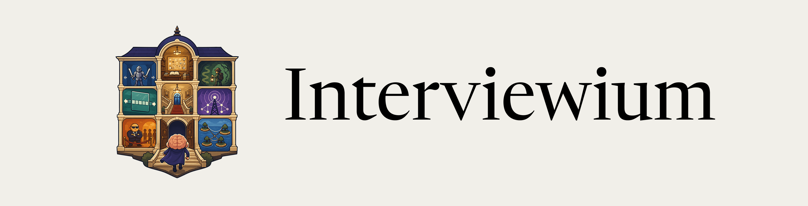

<div align="center">
    
</div>

A small interview prep site built around pattern recognition, not brute-force problem grinding.

The premise is simple: most coding interview questions reduce to a limited set of recognizable shapes. Learn those shapes, the prompt signals that reveal them, and a concise TypeScript template for each one. Then spend a week reviewing the map instead of scattering notes across dozens of problem pages.

## What is inside

- Algorithms and data structures patterns
- Software engineering problems
- TypeScript templates
- Short pitfalls and recognition cues
- Content-driven routing from markdown files

## Run locally

```sh
bun install
bun run dev
```

For checks:

```sh
bun run typecheck
bun run build
```

The production build prerenders every content route into `dist/client`, including
`404.html`, so the site can be hosted as static files.

## Content model

Add pages under:

```text
content/<track>/<group>/<page>.md
```

Add `_meta.yml` files at the track or group level to control labels, order, and short descriptions.
